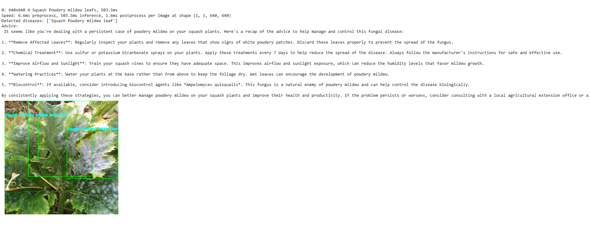

# YOLOv12 Plant Disease & Weed Detection

[](https://www.python.org/)  
[](https://colab.research.google.com/github/<your‑username>/<your‑repo>/blob/main/Yolov12_plant_disease_detection.ipynb)  
[](LICENSE)

---

## 🚀 Project Overview

Modern agriculture increasingly relies on automated, AI‑driven systems to monitor crop health and manage weeds—two critical factors that directly impact yield, quality, and sustainability. This project delivers a complete pipeline that:

1. **Assembling & Preparing Custom Datasets**  
   - Downloads a **plant‑disease** dataset (scab, blight, mildew, viral spots, etc.) and a **weed** dataset from two Roboflow workspaces.  
   - Merges them under a unified `data.yaml` to maintain consistent class mappings and streamline training across both domains.
   - Cover key concepts like , data merzing and **model zoo** aproach , working with two multiple models for the same problem. 

2. **Trains & Fine‑Tunes Specialist YOLOv12 Models**  
   - Uses Ultralytics’ YOLOv12 architecture to build two separate detectors:  
     - **Plant Disease Model** — sensitive to subtle lesion patterns and leaf deformations for early disease detection. I used two unique datsets from robo flow , for the plant disease detection and merged them together.
     - **Weed Detection Model** — optimized for identifying common weed species against crop backdrops.  
   - Training hyperparameters (epochs, batch size, learning rate schedules) are fully configurable in the notebook.  
   - Tracks performance via precision, recall, and mAP metrics.

3. **Performs Dual‑Model Inference via Model Zoo**  
   - Implements a “two‑specialist” inference strategy rather than a single all‑in‑one model, reducing class overlap errors.  
   - Runs both models on each image and fuses their outputs with clear annotations:  
     - **D\_** prefixes for disease classes (e.g., `D_Powdery_mildew`)  
     - **W\_** prefixes for weed classes (e.g., `W_Johnson_grass`)  

4. **Integrates GPT‑4o for Natural‑Language Disease Analysis**  
   - Feeds detected disease names and confidence scores into OpenAI’s GPT‑4o API.  
   - Generates actionable agronomic advice and best‑practice treatment suggestions.
   - Fine tuning the gpt model according to the use case by giving it a .json file to learn on.
   - Transforms raw detection boxes into an intuitive “field report".

## 📈 Fine‑Tuning Results

Below are the quantitative improvements observed after fine‑tuning our YOLOv12 plant‑disease detector:

| Metric           | Before Fine‑Tuning | After Fine‑Tuning |
|------------------|:------------------:|:-----------------:|
| **mAP @ 0.50**       |       0.7697       |       0.7930      |
| **mAP @ 0.75**       |       0.7060       |       0.7248      |
| **mAP @ 0.50–95**    |       0.5962       |       0.6216      |

<p align="center">
  
</p>

<p align="center">
  
</p>

**Results For Model zoo aproach**


| Metric           | After Fine‑Tuning |
|------------------|:------------------:|
| **mAP @ 0.50**       |       0.7535 | 
| **mAP @ 0.75**       |       0.9756 |      
| **mAP @ 0.50–95**    |       0.87997|   


<p align="center">
  
</p>

<p align="center">
  
</p>

**Results For Plant disease detector +  GPT**

<p align="center">
  
</p>

## 📖 Citation

```bibtex
@article{tian2025yolov12,
  title={YOLOv12: Attention-Centric Real-Time Object Detectors},
  author={Tian, Yunjie and Ye, Qixiang and Doermann, David},
  journal={arXiv preprint arXiv:2502.12524},
  year={2025}
}


